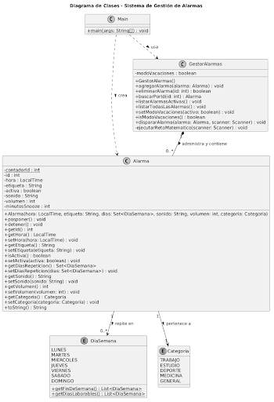
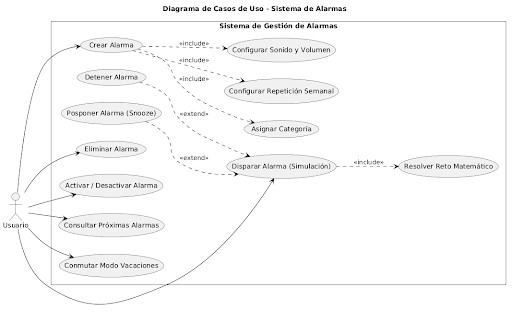

# Trabajo-Entornos-3EV-Carlos-Marmol


Aquí tienes un archivo README.md con un diseño limpio, profesional y estructurado en Markdown, listo para que lo copies y lo pegues en la raíz de tu repositorio de Git.

Markdown
Sistema de Gestión de Alarmas (Core Lógico OOP)


Una aplicación de consola desarrollada en Java diseñada bajo principios arquitectónicos robustos. El sistema se centra exclusivamente en el **diseño de software, la lógica de negocio y la alta cohesión**, omitiendo dependencias de interfaces gráficas o bases de datos complejas para garantizar la pureza del modelo de dominio.

---

Descripción del Proyecto

El sistema es un motor de gestión de alarmas horarias que permite un control exhaustivo sobre las alertas del usuario. Soporta múltiples alarmas simultáneas con repetición semanal granular y configuraciones personalizadas de audio/volumen. 

Además del comportamiento base, incorpora tres funcionalidades de última generación:
1. **Retos Matemáticos Obligatorios:** Mecanismo de seguridad cognitiva que impide apagar el sonido de la alarma hasta que el usuario resuelva con éxito una operación matemática aleatoria.
2. **Modo Vacaciones Global:** Un interruptor general del sistema que congela temporalmente todas las alertas sin necesidad de eliminarlas o apagarlas individualmente, ideal para periodos de descanso.
3. **Clasificación por Categorías:** Clasificación semántica de las alarmas (`Trabajo`, `Estudio`, `Medicina`, `Deporte`, `General`) para permitir una gestión ordenada del día a día.

---

Objetivos

El desarrollo de este software resuelve los siguientes problemas del mundo real y desafíos de ingeniería:

* **Estructuración Antiespagueti (Desacoplamiento):** Separa estrictamente la interfaz de usuario (Consola/CLI), el controlador logístico (`GestorAlarmas`) y las entidades del dominio (`Alarma`), permitiendo que el sistema sea escalable a entornos Web o Gráficos (GUI) en el futuro sin modificar la lógica existente.
* **Prevención de Estados Corruptos (Integridad):** Mediante validaciones defensivas en constructores y *setters*, el sistema imposibilita la creación de alarmas con volúmenes negativos, horas desbordadas o días duplicados.
* **Inercia del Sueño (Despertar Efectivo):** Mitiga el apagado inconsciente de alarmas obligando al cerebro a activarse mediante gamificación matemática antes de habilitar los comandos de detención o posposición (*snooze*).

---

Tecnologías Utilizadas

* **Lenguaje de Programación:** Java (Compatible con JDK 17 o superior).
* **API de Tiempo:** `java.time.LocalTime` para un manejo nativo, exacto e inmutable del tiempo.
* **Colecciones Avanzadas:** `java.util.Set` y `HashSet` para el control de días únicos en repeticiones semanales.
* **Herramientas de Modelado:** PlantUML para el diseño de la arquitectura de clases y flujos de casos de uso.

---

 Instalación y Ejecución

Al ser un proyecto nativo y autocontenido, no requiere de gestores de dependencias externos como Maven o Gradle.

### Prerrequisitos
* Tener instalado el **Java Development Kit (JDK)** versión 17 o superior.
* Verificar la instalación ejecutando en tu terminal:
  ```bash
  java -version


  
DIAGRAMA DE CLASES




Gestor Alarmas tiene una relación de composición con Alarma (1 a muchos). Si el gestor se destruye, la lista en memoria de las alarmas también desaparece. El gestor es el dueño de su ciclo de vida.
La Alarma conoce y utiliza un conjunto de DiaSemana para controlar la repetición.
La Alarma tiene asignada exactamente una Categoria para clasificar su propósito.
La clase Main no almacena las alarmas de forma estructural, sino que depende de GestorAlarma y Alarma de forma efímera para inicializar la aplicación, capturar los datos de la consola y arrancar el menú interactivo.


DIAGRAMA DE CASOS





En este trabajo la inteligencia me ayudo a hacer gran parte del programa en cuanto codigo se refiere. Tambien el propio visual studio me ayudo a ejecutar los commits necesarios para agregarlo todo al repositorio


  
